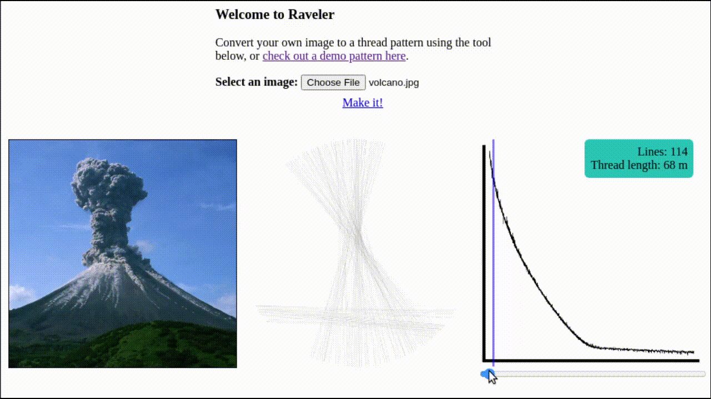

Raveler
======

Inspired by Petros Vrellis ["A New Way to Knit" (2016)](http://artof01.com/vrellis/works/knit.html).

Try it at [https://jperryhouts.github.io/raveler/](https://jperryhouts.github.io/raveler/)

Image: Karymsky volcano (Kamchatka), 2004  
credit Alexander Belousov (distributed via [imaggeo.egu.eu](https://imaggeo.egu.eu/view/646/)).
